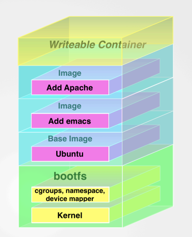

# Docker en el entorno de desarrollo

# 

^ Theme: Next, Color: 5

---

# Alejandro Hernández (@aleherse)


Desarrollador de aplicaciones web, consultor y formador.

Trabajando actualmente en un juego web de estrategia por turnos ambientado en la antigua Grecia

+info: http://about.me/aleherse

---

# ¿Qué es Docker?

## Software Open Source que automatiza el despliegue de aplicaciones dentro de contenedores

^ Entorno virtualizado de ejecución + sistema ligero y rápido de despliegue

---

# ¿Qué hay en un contenedor?

* Sistema de ficheros completo
* Cualquier cosa que pueda instalarse en linux
* Nuestra aplicación

^ Esto nos garantiza que el software se ejecutará siempre de la misma manera independientemente del hardware y SO de la máquina anfitrión

---

# Contenedores vs Máquinas Virtuales

 * Ejecución en espacio de usuario sobre el kernel del SO

^ No requiere software de virtualización (hypervisor). A veces llamada virtualización a nivel de sistema operativo

---

# Contenedores vs Máquinas Virtuales

 * Ejecución en espacio de usuario sobre el kernel del SO
 * Menor sobrecarga de la máquina anfitrión

^ No hay que levantar un SO por cada contenedor

---

# Contenedores vs Máquinas Virtuales

 * Ejecución en espacio de usuario sobre el kernel del SO
 * Menor sobrecarga de la máquina anfitrión
 * Permite multiples instancias aisladas

^ Puedes levantar varios contenedores de la misma imagen y además aislados en su propia red

---

# Contenedores vs Máquinas Virtuales

 * Ejecución en espacio de usuario sobre el kernel del SO
 * Menor sobrecarga de la máquina anfitrión
 * Permite multiples instancias aisladas
 * Requiere un kernel de Linux

^ máquina host debe ser linux así como el contenido de la imagen

---


^ gráfico que compara máquinas virtuales con contenedores

---

# Tecnología detrás de Docker

 * Linux Kernel Control Groups (cgroups)

^ Docker combina tecnologías ya existentes

^ cgroups => limita el consumo de recursos CPU, memoria, red...

---

# Tecnología detrás de Docker

 * Linux Kernel Control Groups (cgroups)
 * Linux Kernel Namespaces

^ namespaces => aisla y virtualiza, limita lo que un proceso puede ver del SO

---

# Tecnología detrás de Docker

 * Linux Kernel Control Groups (cgroups)
 * Linux Kernel Namespaces
 * Union Mount

^ union mount => combinar varios directorios que aparentar ser uno sólo

---

# Tecnología detrás de Docker

 * Linux Kernel Control Groups (cgroups)
 * Linux Kernel Namespaces
 * Union Mount
 * Docker libcontainer

^ libcontainer => librería en Go que hace uso de los capacidades de virtualización del kernel de linux

---

# Objetivos de Docker

* Forma fácil y rápida de modelar la realidad

^ Crea una imagen a partir de una base en minutos

^ La mayoría de contenedores pasan a ejecución en menos de un segundo

---

# Objetivos de Docker

* Forma fácil y rápida de modelar la realidad
* Segregación lógica de tareas

^ desarrolladores se preocupan de las aplicaciones dentro del contenedor

^ operaciones se encargan de gestionar los contenedores

---

# Objetivos de Docker

* Forma fácil y rápida de modelar la realidad
* Segregación lógica de tareas
* Ciclo de desarrollo eficiente y rápido

^ el entorno de ejecución de la aplicación es el mismo, sea desarrollo, test o producción

^ Aplicación rápidamente transportable

---

# Objetivos de Docker

* Forma fácil y rápida de modelar la realidad
* Segregación lógica de tareas
* Ciclo de desarrollo eficiente y rápido
* Promueve arquitectura orientada a servicios

^ Cada contenedor debe ejecutar una única aplicación o proceso

---

# Componentes

* Docker Engine
* Docker Images
* Docker Containers
* Registries

^ Engine => servidor que se ejecuta en el anfitrión y cliente que conecta e interacciona con él

^ Image => Bloque básico de construcción en docker, debe basarse en una imagen base (empaquetado)

^ Container => Ejecutados desde una imagen y contienen uno o más procesos (ejecución)

^ Registry => Lugar en el que almacenar las imágenes construidas, como un github para imágenes

---

# Instalación

Guía muy completa en la web

Existen aplicaciones para OSX y Windows

Puedes descargar y ejecutar un script para Linux

^ Linux, kernel > 3.10 y otros requisitos

^ Windows y Linux instalan una máquina virtual mínima donde se ejecuta el servidor

^ Clientes de Windows y Linux presentan algunos problemas de desempeño

---

# Docker containers

* Un formato de imagen
* Un conjunto de operaciones estándar
* Un entorno de ejecución

^ cada contenedor se ejecuta a través de una imagen

^ permite operaciones como start, stop, restart and destroy

^ Docker es independiente del contenido al ejecutar las acciones y es ejecutado de la misma forma que cualquier otro contenedor

---

# ¡Manos a la obra!

## Contenedores

---

¿Funciona?

```
  $ docker info
```

Ejecutemos nuestro primer contenedor

```
  $ docker run -i -t ubuntu /bin/bash
```

Juguemos un poco

```
  # hostname
  # ls -la
  # cat /etc/hosts
  # ps -aux
  # exit
```

^ run => ejecutar un comando

^ flags => -i mantiene entrada estándar abierta, -t asigna un pseudo terminal al contenedor. Interactive shell

^ ubuntu => imagen a partir de la cual crear el contenedor (si no la tenemos la descarga)

^ /bin/bash => comando a ejecutar en el contenedor

^ exit => para el contenedor, que se ejecuta hasta que el comando finaliza

---

¿Qué ha pasado con nuestro contenedor?

```
  $ docker ps -a
  $ docker start <container_name>
  $ docker ps
  $ docker attach <container_name>
```

^ docker ps => lista todos los contenedores (sin -a sólo en ejecución)

^ ID, imagen, última ejecución, comando, estado de finalización, nombre

^ start => reinicia un contenedor parado

^ attach => asociarse a un contenedor en ejecución

---

Ejecutar contenedores en segundo plano

```
  $ docker run --name daemon -d ubuntu /bin/sh -c \
    "while true; do echo hello world; sleep 1; done"
  $ docker ps

  $ docker logs -f deamon
  [Ctrl-C]
  $ docker exec -d daemon touch /new_file
  $ docker exec -t -i daemon /bin/bash
  # ls -la
  [Ctrl-C]
  $ docker stop daemon
  $ docker rm daemon
```

^ no tienen sesión interactiva y son ideales para ejecutar aplicaciones o servicios

^ --name => establecemos nosotros el nombre del contenedor, debe ser único

^ -d => desasociarse del contenedor y ejecutarlo en segundo plano

^ logs -f => lista los logs del contenedor (-f como tail)

^ exec => permite ejecutar comandos en un contenedor en ejecución en segundo plano o interactivo

^ stop => envía la señal SIGTERM al contenedor, si este no responde en 10 segundos se envía un SIGKILL

^ rm => elimina el contenedor, pero no la imagen en la que se basa

---

# Docker Images



Base image contiene el sistema operativo mínimo (debian < 150mb)

Gracias a *union mount* docker superpone varios sistema de ficheros de solo lectura

Añade al final un sistema de ficheros de lectura-escritura

^ bootfs normalmente se desmonta cuando el contenedor arranca

^ un sistema de ficheros (llamada imagen) con emacs, otro con apache

^ en el fs de lectura-escritura es donde nuestro proceso se ejecutará

^ cuando se modifica un fichero de una imagen => copy on write => se copia a la capa de escritura

---

# ¡Manos a la obra!

## Imágenes

---

Repositorio de imágenes oficial:

https://hub.docker.com/

¿Cómo construir nuestra propia imagen?

---

Creamos un fichero `Dockerfile` conteniendo:

```
FROM ubuntu:16.04

RUN apt-get update; apt-get install -y nginx
RUN echo 'Soy un fichero dentro del contenedor' \
    > /var/www/html/index.html

EXPOSE 80    
```

^ ejecutar "docker build -t aleherse/static_web ." porque tarda

^ Dockerfile es un fichero de texto con las instrucciones para construir la imagen

^ cada instrucción va añadiendo una capa a la imagen

^ FROM => imagen base : tag (versión concreta de ubuntu)

^ RUN => comandos que modifican la imagen

^ si falla en alguna línea todas las anteriores se mantiene, si se relanza no se repite lo ya construido => rápido

^ EXPOSE => especifica que la aplicación en el contenedor usa ese puerto (pero no lo abre)

^ La documentación tiene todas las instrucciones posibles, veremos algunas a través de ejemplos

---

Comandos relacionados con imágenes

```
  $ docker build -t aleherse/static_web .
  $ docker images
  $ docker rmi aleherse/static_web
```

^ build => ejecuta las instrucciones en el fichero añadiendo capas a la imagen base

^ -t nombre de la imagen . dice dónde está el fichero dockerfile

^ build envía el contexto al servidor

^ listar y borrar imágenes

---

# Docker Compose

Inicia una serie de contenedores definidos en un fichero YAML

Incluido en Docker para OSX y Windows

Para usar en linux seguir los pasos de instalación de:

https://github.com/docker/compose/releases

---

# ¡Manos a la obra!

## Orquestración

---

**Funcionalidades de nuestra aplicación de ejemplo**

* Muestra un formulario con destinatario, asunto y contenido
* Envía el contenido del formulario en un correo electrónico
* Almacena los datos del correo con la fecha de envío
* Lista todo los correos que se han enviado

---

**¿Qué software tenemos en producción?**

* Aplicación PHP 7.1.0
* Servidor web Nginx 1.11.6
* Base de datos MySQL 5.7.16
* Servidor SMTP Postfix 3.5

^ aplicaciones que tengo en el servidor de producción

---

**Aplicación PHP 7.1.0**

```
FROM php:7.1.0-fpm

RUN apt-get update && apt-get install -yq git vim zip && \
    docker-php-ext-install mysqli pdo pdo_mysql && \
    apt-get clean && \
    rm -rf /var/lib/apt/lists/* /tmp/* /var/tmp/*
ENV COMPOSER_ALLOW_SUPERUSER=1
...
COPY local.ini /usr/local/etc/php/conf.d/
WORKDIR /app
VOLUME /app
EXPOSE 9000
CMD ["php-fpm", "-F"]
```

^ FROM imagen base oficial de PHP 7.1.0 con fpm (FastCGI Process Manager)

^ RUN ejecuta instrucciones, instala los paquetes que necesitamos y hace limpieza (menor tamaño de imagen)

^ ENV define variables de entorno durante la construcción de la imagen

^ COPY copia un fichero del contexto (origen y subdirectorios)

^ ADD además puede descomprimir ficheros tar y descargar de internet

^ WORKDIR establece el directorio de trabajo para RUN, CMD, ENTRYPOINT, COPY and ADD

^ VOLUME merece una mención especial

^ EXPOSE define un puerto que la imagen expone, al ejecutar debe asociarse con un puerto local para ser usado

^ CMD Especifica el comando a ejecutar cuando se inicie el contenedor, puede modificarse el ejecutar

---

**Un inciso sobre los volúmenes**

* Comparten ficheros del anfitrión en el contenedor

---

**Un inciso sobre los volúmenes**

* Comparten ficheros del anfitrión en el contenedor
* Se saltan el Union Mount

^ los cambios no pasan a la imagen, no se crea una nueva capa

---

**Un inciso sobre los volúmenes**

* Comparten ficheros del anfitrión en el contenedor
* Se saltan el Union Mount
* Puede compartirse y reutilizarse entre contenedores

---

**Un inciso sobre los volúmenes**

* Comparten ficheros del anfitrión en el contenedor
* Se saltan el Union Mount
* Puede compartirse y reutilizarse entre contenedores
* Puede ser compartido sin estar en ejecución el contenedor

^ ... que declara el volumen

---

**Un inciso sobre los volúmenes**

* Comparten ficheros del anfitrión en el contenedor
* Se saltan el Union Mount
* Puede compartirse y reutilizarse entre contenedores
* Puede ser compartido sin estar en ejecución el contenedor
* Existen hasta que no haya ningún contenedor que lo use

^ Útil para contener el código de la aplicación mientras desarrollamos

^ persistencia de base de datos, logs... (No soy fan de BD en Docker)

^ sólo declara el punto de montaje de la imagen, al hacer RUN debe establecerse el origen

---

**Servidor web Nginx 1.11.6**

```
FROM nginx:1.11.6

COPY nginx.conf /etc/nginx/
COPY web.conf   /etc/nginx/conf.d/
RUN echo "upstream php-upstream { server app:9000; }" >
    /etc/nginx/conf.d/upstream.conf

VOLUME /app
EXPOSE 80

CMD ["nginx"]
```

^ Imagen basada en la oficial para nginx

^ COPY copia del contexto los ficheros de configuración del servidor nginx

^ RUN echo podría haberse hecho con un COPY también

---

**Fichero docker-compose.yml (1/2)**

```
version: '2'
services:
    app:
        build: docker/php
        volumes:
            - ./app:/app
    server:
        build: docker/nginx
        ports:
            - "80:80"
        volumes_from:
            - app
  ...
```

^ orquestración de contenedores

^ version: el formato de compose cambió, la presencia de esta línea indica cual se usa

^ services: listado de los servicios (o contenedores). Cada uno tiene un nombre

^ build: indica que el servicio se construye a través de un dockerfile en ese directorio

^ volumes: carpeta con el código en anfitrión que serán montadas como volúmenes en el contenedor

^ ports: mapeo de puertos entre el anfitrión y el contenedor (cuidado con colisiones)

^ volumes_from: nginx debe tener acceso al código de la aplicación para ello accede al volumen de app

---

**Fichero docker-compose.yml (2/2)**

```
  ...
    db:
        image: mysql:5.7.16
        ports:
            - "3306:3306"
        environment:
            MYSQL_ROOT_PASSWORD: root
            MYSQL_DATABASE: web
            MYSQL_USER: web
            MYSQL_PASSWORD: password
        volumes:
            - ./docker/mysql/:/docker-entrypoint-initdb.d
    mailcatcher:
        image: schickling/mailcatcher
        ports:
            - "1080:1080"
```

^ image: la base de datos se construye a partir de la imagen oficial

^ ports: mapea el puerto para acceder con nuestro cliente desde el anfitrión

^ environment: establece variables de entorno con la configuración de la BD

^ volumes: en este caso nos permite ejecutar sql durante la creación del contenedor

^ en vez de postfix usamos mailcatcher servidor SMTP que captura correos y los muestra en una interfaz web

^ image: mailcatcher no tiene imagen oficial, lo cogemos de la imagen pública de un usuario

---

```
  $ docker-compose build
  $ docker-compose up
  [Ctrl-C]
  $ docker-compose up -d
```

**Puntos de acceso desde el anfitrión**

* Nginx `http://localhost/`
* Aplicación `http://local.dev/`
* Mailcatcher `http://local.dev:1080/`
* MySQL `localhost:3306`

^ build: crea los contenedores que usan ficheros Dockerfile

^ up: crea los contenedores definidos en docker-compose.yml (si no existen) los ejecuta y muestra los logs de cada uno

^ up -d permite la ejecución de los contenedores en segundo plano

^ mostrar páginas y cliente MySQL

---

**Compose** crea una red por defecto para la aplicación, cada servicio se une a esta red y son accesibles y detectable entre ellos usando el nombre del servicio

```
  $ docker network ls
  $ docker network inspect dockerfordevelopment_default
  $ docker-compose exec app /bin/bash
  # ping db
  [Ctrl-C]
  # ping server
  [Ctrl-C]
```

^ ls => lista las redes que se han creado

^ info => proporciona información sobre los servicios registrados en la red

^ ping => vemos que los contenedores están conectados mediante su nombre

---

```
  $ docker-compose ps
  $ docker-compose logs
  $ docker-compose logs db
  $ docker-compose run app /bin/bash
  $ docker-compose stop
  $ docker-compose start
  $ docker-compose stop
  $ docker-compose ps
  $ docker-compose rm
  $ docker-compose ps
```

^ ps =>lista los servicios y su estado

^ logs => eventos logueados en nuestros servicios (o especificado)

^ run => <nombre del servicio> <comando> para ejecutar comandos arbitrarios en los contenedores

^ stop => detiene todos los servicios (o el especificado)

^ start => inicia los servicios

^ rm => elimina los contenedores y volúmenes

---

# ¡Manos a la obra!

## Aplicación de ejemplo

### https://github.com/aleherse/docker-for-development

^ mostrar el código de docker

^ mostrar el código de la aplicación silex

^ ver que al enviar el formulario el correo se envía y la BD se actualiza

---

# Ventajas de Docker en desarrollo

* Mismo código, Sistema Operativo y aplicaciones

^ el entorno de ejecución es siempre el mismo

^ siempre y cuando las versiones se especifiquen

---

# Ventajas de Docker en desarrollo

* Mismo código, Sistema Operativo y aplicaciones

* Más ligero que una máquina virtual

^ vimos al principio que necesitan menos recursos que una MV

---

# Ventajas de Docker en desarrollo

* Mismo código, Sistema Operativo y aplicaciones

* Más ligero que una máquina virtual

* Independiente de la máquina del desarrollador

^ Ya trabajes en Linux, OSX o Windows

^ Fácil de pasar al diseñador gráfico o entorno distinto

---

# Ventajas de Docker en desarrollo

* Mismo código, Sistema Operativo y aplicaciones

* Más ligero que una máquina virtual

* Independiente de la máquina del desarrollador

* Es muy fácil cambiar versiones de software (PHP 5.6 a PHP 7)

^ basta modificar una línea en el Dockerfile y reconstruir la imagen

---

# Ventajas de Docker en desarrollo

* Mismo código, Sistema Operativo y aplicaciones

* Más ligero que una máquina virtual

* Independiente de la máquina del desarrollador

* Es muy fácil cambiar de versión (PHP 5.6 a PHP 7)

* Es trivial reconstruir el entorno

^ eliminar los contenedores/imágenes y reconstruirlos

---

# Ventajas de Docker en desarrollo

* Mismo código, Sistema Operativo y aplicaciones

* Más ligero que una máquina virtual

* Independiente de la máquina del desarrollador

* Es muy fácil cambiar de versión (PHP 5.6 a PHP 7)

* Es trivial reconstruir el entorno

* Si modificas el contenedor actualiza el Dockerfile

^ Los contenedores deben ser desechables, si haces algún cambio actualiza el dockerfile

---

# ¿Por dónde continuar?

* Documentación oficial (docs.docker.com)
* Imágenes en **Docker Hub** (hub.docker.com)
* **The Docker book** (dockerbook.com)
* Búsqueda de **Docker** en **YouTube**
* Crea contenedores para tus proyectos más sencillos
* Usar docker para testeo y producción

---

# ¿Preguntas?
