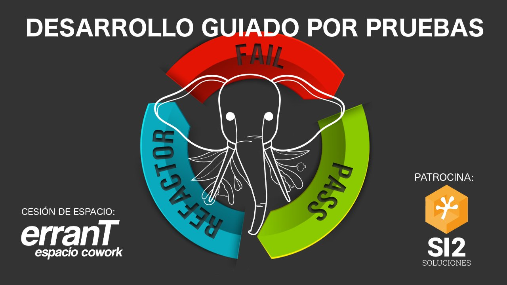
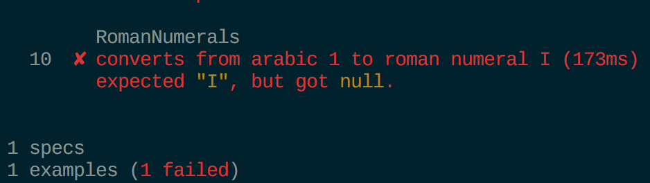
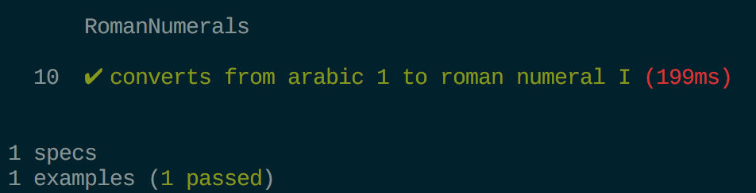
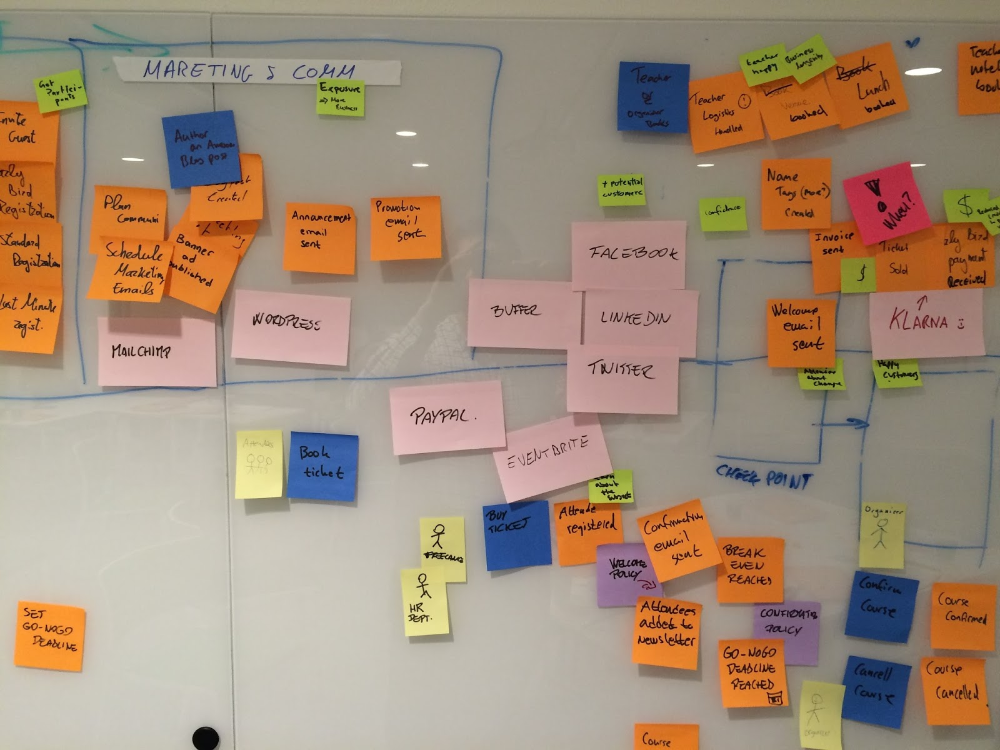
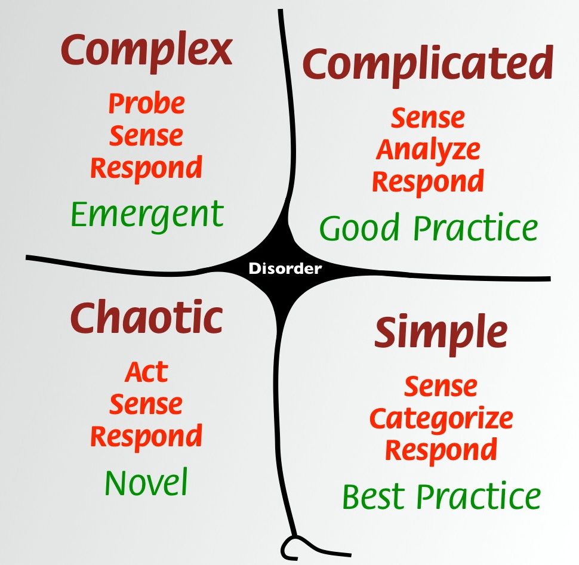

theme: Next, 1
slidenumbers: true



---

# Alejandro Hernández (@aleherse)


Desarrollador de aplicaciones web, consultor y formador.

Cuando no trabajo para un cliente desarrollo un bot de Telegram para gestionar clubs de juegos de mesa.

+info: http://about.me/aleherse

---

# Agile Manifesto

**Individuos e interacciones** sobre procesos y herramientas

**Software funcionando** sobre documentación extensiva

**Colaboración con el cliente** sobre negociación contractual

**Respuesta ante el cambio** sobre seguir un plan

Esto es, aunque valoramos los elementos de la derecha, valoramos más los de la izquierda.


^ Que popularizó las metodologías ágiles como TDD

^ en 2001 17 personas se reunieron para hablar sobre alternativas a los procesos existentes de desarrollo de software

^ Desarrollo en cascada no es útil, necesitamos metodologías más ágiles e incrementales

---

# ¿Qué es?

**T**est **D**riven **D**evelopment

Técnica de diseño e implementación de software.

^ y por eso se llama TDD

^ Desarrollo guiado por pruebas

---


---

# ¿Cómo funciona? (fail)

**Escribe una prueba (test)**

```PHP
function it_converts_from_arabic_1_to_roman_numeral_I()
{
    $this->fromArabic(1)->shouldReturn('I');
}
```

^ no existe código todavía por lo que la prueba falla

---

# ¿Cómo funciona? (fail)

**Ejecuta la prueba y mira como falla**



---

# ¿Cómo funciona? (pass)

**Escribe suficiente código**

```PHP
public function fromArabic(int $arabic): string
{
    return 'I';
}
```

^ El justo y necesario para que pase la prueba

---

# ¿Cómo funciona? (pass)

**Ejecuta la prueba y mira como pasa**



---

# ¿Cómo funciona? (refactor)

**Mejora la calidad del código**

- Extraer código a un método, clase, colaborador...
- Eliminar repeticiones
- Generalizar la lógica
- Renombrar variables, métodos, clases..

[refactoring.guru](https://refactoring.guru/refactoring)

^ paso fundamental y a veces olvidado

^ consiste en cambiar el código sin modificar el comportamiento

^ todos los ejemplos deben de seguir pasando

^ no se debería añadir nuevo comportamiento

^ La web tiene un curso de pago pero leer las técnicas es gratuito

^ Todas esas técnicas dan para una charla completa

---

# Tipos de pruebas

## Aceptación

Funcionalidad desde el punto de vista del usuario

^ Extremo a extremo

^ Es lo que el cliente nos ha pedido

^ Interactua con todo nuestro sistema

---
# Tipos de pruebas

## Aceptación

## Integración

Nuestro código al interactuar con algo externo  

^ Ya sea framework, librería, base de datos, API

^ Incluso código que desarrolla otro equipo

^ Otro microservicio

---

# Tipos de pruebas

## Aceptación

## Integración

## Unitarias

Nuestros objetos hacen lo que se espera de ellos

^ TDD entra en esta categoría

^ se prueba cada objeto por separado

---

# Pilares fundamentales

- Implementar únicamente lo que el cliente necesita

^ Los tests definen el comportamiento

^ El código debería ser el suficiente para que pasen

---

# Pilares fundamentales

- Implementar únicamente lo que el cliente necesita
- Minimizar el número de errores que llegan a producción

^ Pruebas de regresión: pruebas anteriores comprueban si la nueva funcionalidad rompe algo

^ Pueden existir pruebas erróneas o incompletas

---

# Pilares fundamentales

- Implementar únicamente lo que el cliente necesita
- Minimizar el número de errores que llegan a producción
- Implementar código modular, reutilizable y adaptable

^ La fase de refactor nos permite limpiar y mejorar la calidad del código

---

# Pilares fundamentales

- Implementar únicamente lo que el cliente necesita
- Minimizar el número de errores que llegan a producción
- Implementar código modular, reutilizable y adaptable
- Aumentar la confianza del equipo en el código

^ Los tests aumentan nuestra seguridad en que el código hace lo que debe

---

# TDD es una herramienta más

^ No es la única técnica de diseño y no todo puede afrontarse con ella

^ Algunas otras que pueden ayudarnos son

---

# Desarrollo guiado por comportamiento (BDD)


---

# Desarrollo guiado por comportamiento (BDD)

```gherkin
Scenario: Some determinable business situation
  Given some precondition
  And some other precondition
  When some action by the actor
  And some other action
  And yet another action
  Then some testable outcome is achieved
  And something else we can check happens too
```

^ BDD utiliza un lenguaje llamado Gherkin que es muy legible

^ Cada uno de esas líneas tendrá código detrás que haga lo que dice

^ Más adelante haré alguna charla sobre BDD

---

# Event Storming



[eventstorming.com](http://eventstorming.com/)

^ Permite compartir y unificar el conocimiento que tenemos del sistema expertos, programadores y testeadores


---

# Cynefin



[Cynefin for devs by Liz Keogh](https://lizkeogh.com/2012/03/11/cynefin-for-devs/)

^ Permite categorizar el tipo de trabajo que estamos haciendo

^ Simple: Cualquiera puede hacerlo, muy estudiado, no va a cambiar. Quizás no necesita tests

^ Complicado: Predecible aunque require experiencia. Ideal para TDD/BDD

^ Complejo: Hace falta comunicar, colaborar, poner conocimiento en común, probar alternativas

^ Caos: Algo grave sobre lo que hay que actuar rápido, ya habrá tiempo de analizar y testear

---

# Algunos consejos útiles

- Busca ejemplos relevantes

^ Especifican comportamiento concretos que debe contemplar la aplicación

---

# Algunos consejos útiles

- Busca ejemplos relevantes
- Escribe pruebas específicas

^ Nombres relevantes con situaciones fáciles de entender

---

# Algunos consejos útiles

- Busca ejemplos relevantes
- Escribe pruebas específicas
- Escribe código que sea cada vez más genérico

^ Cada vez que escribes código que hace pasar un ejemplo el código pasa a ser cada vez mas genérico

---

# Algunos consejos útiles

- Busca ejemplos relevantes
- Escribe pruebas específicas
- Escribe código que sea cada vez más genérico
- Refactoriza pensando como un diseñador/arquitecto

^ Durante la fase de refactor, mejora los nombres, extrae métodos/colaboradores, utiliza patrones de diseño

---

# Algunos consejos útiles

- Busca ejemplos relevantes
- Escribe pruebas específicas
- Escribe código que sea cada vez más genérico
- Refactoriza pensando como un diseñador/arquitecto
- No tengas miedo a borrar/mover/modificar código

^ Cada prueba se convierten en un test de regresión para las siguientes

^ Modifica el código para mejorar la calidad interna

^ Si algo deja de funcionar lo sabremos

---

# Algunos consejos útiles

- Busca ejemplos relevantes
- Escribe pruebas específicas
- Escribe código que sea cada vez más genérico
- Refactoriza pensando como un diseñador/arquitecto
- No tengas miedo a borrar/mover/modificar código
- Las pruebas son código también, cuídalo

^ Mantén limpia tu batería de pruebas

^ Si es dificil añadir o cambiar tests añade complejidad al proceso

^ Aunque no hay que llegar a los niveles del código de la aplicación

---

# Algunos consejos útiles

> "Act locally. Think Globally."
-- Ron Jeffries

##

> "Something that is hard to test is badly designed."
-- Uncle Bob

---

# Algunos consejos útiles

## Demeter Law

Habla únicamente con los colaboradores más próximos

```php
$this->getPerson()->getCar()->ignite();
```

^ o Principio del Menor Conocimiento

^ Habla únicamente con tus colaboradores y no te involucres con extraños

^ Este comportamiento es dificil de testear porque hay que crear mocks de cada uno de los colaboradores

^ Hay muchas clases involucradas

---

# Algunos consejos útiles

## Demeter Law

Habla únicamente con los colaboradores más próximos

```php
$this->getPerson()->getCar()->ignite();
```

debería ser

```php
$this->person->startCar();
```

^ Tenemos únicamente un colaborador “person” y le pedimos que arranque el coche, no nos importa cómo se hace

^ Lo que nos lleva a...

---

# Algunos consejos útiles

## Tell don't Ask

- Comportamiento donde la información reside
- Minimiza las interacciones entre objetos

```php
if ($user.isAuthenticated()) {
	echo “hola de nuevo “ . $user.getName();
} else {
	echo “bienvenido!”;
}
```

---

# Algunos consejos útiles

## Tell don't Ask

- Comportamiento donde la información reside
- Minimiza las interacciones entre objetos

```php
echo $user->welcomeMessage();
```

---

# Algunos consejos útiles

## The Transformation Priority Premise

| | |
| --- | --- |
| null to constant | unconditional to if |
| constant to constant+ | if to while |
| constant to scalar | expression to function |
| statement to statements |

---

# Kata de los números romanos

ej: 148 => CXLVIII

^ podríamos empezar número a número pero es fácil atrancarse de ese modo 

---

# Kata de los números romanos

ej: 148 => CXLVIII

|  |  |  |
| ---      | ---       | ---       |
|          | 5 => V    |           |
| 1 => I   | 6 => VI   | 10 => X   |
| 2 => II  | 7 => VII  | 20 => XX  |
| 3 => III | 8 => VIII | 30 => XXX |
| 4 => IV  | 9 => IX   | 40 => XL  |
| 100 => C | 500 => D  | 1000 => M |

^ 1 a 3 repetimos I

^ 4 es un poco raro

^ 5 ponemos una V

^ 6 a 8 V y repetimos I

^ 9 es raro

^ 10, 20, 30 repetimos X

^ 40 es raro

^ 50 es similar a V

^ 100 es similar a I y X

---

# Conclusiones

- Ten en cuenta la curva de aprendizaje

^ empezar a usarlo es costoso y habrá cosas que no sepas cómo afrontar

^ Prueba con algo sencillo

---

# Conclusiones

- Ten en cuenta la curva de aprendizaje
- Más tiempo al inicio del proyecto

^ Debes escribir las pruebas y el código, necesitarás más tiempo del habitual

---

# Conclusiones

- Ten en cuenta la curva de aprendizaje
- Más tiempo al inicio del proyecto
- Menos tiempo al modificar/añadir funcionalidad

^ fase de refactor deja un código más limpio

^ fácil ver que está fallando y donde

---

# Conclusiones

- Ten en cuenta la curva de aprendizaje
- Más tiempo al inicio del proyecto
- Menos tiempo al modificar/añadir funcionalidad
- Aporta confianza al equipo de desarrollo

^ Sabes si algo se ha roto y donde

---

# Conclusiones

- Ten en cuenta la curva de aprendizaje
- Más tiempo al inicio del proyecto
- Menos tiempo al modificar/añadir funcionalidad
- Aporta confianza al equipo de desarrollo
- No necesitas el 100% de cobertura

^ No hagas pruebas de código trivial o que va a modificarse poco

---

# Enlaces de interés

- [Test Driven Development: By Example](https://www.goodreads.com/book/show/387190.Test_Driven_Development)
- [Growing Object-Oriented Software, Guided by Tests](https://www.goodreads.com/book/show/4268826-growing-object-oriented-software-guided-by-tests)
- [Refactoring: Improving the Design of Existing Code](https://www.goodreads.com/book/show/44936.Refactoring)
- [The Transformation Priority Premise
](https://blog.8thlight.com/uncle-bob/2013/05/27/TheTransformationPriorityPremise.html)
- [Giving up on TDD](
http://blog.cleancoder.com/uncle-bob/2016/03/19/GivingUpOnTDD.html)
- [phpspec](http://www.phpspec.net/en/latest/)

^ Particulidades de phpspec

^ Una especificación por cada clase

^ Crea mocks de todos los colaboradores

^ Se basa principalmente en comprobar el paso de mensajes (tb hay estado)

^ No se pueden testear métodos privados

^ No sirve para escribir tests de integración
